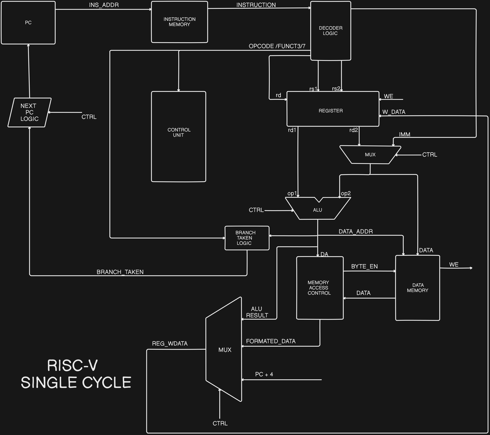

# RISC-V 32I Single Cycle Design

## Project Overview
This project is an implementation of a single cycle RISC-V 32I processor design. The RISC-V 32I instruction set architecture (ISA) is a free and open RISC instruction set architecture based on established RISC principles.

The goal of this project is to design and implement a basic RISC-V 32I processor that can execute a subset of the RISC-V instructions in a single clock cycle.

## Key Features
- Supports a subset of the RISC-V 32I instruction set, including:
  - Integer arithmetic and logical instructions
  - Load and store instructions
  - Branch and jump instructions
- Implemented using a single-cycle design approach
- Written in SystemVerilog
- Includes a testbench for verifying the functionality of the processor

## Project Structure
### RTL Block Diagram


```
Single_Cycle/
├── control_unit.sv
├── data_memory.sv
├── instr_memory.sv
├── mem_access_control.sv
├── reg_file.sv
├── riscv_core.sv
├── riscv_pkg.sv
├── riscv_top.sv
└── riscv_top_tb.sv
```

- `control_unit.sv`: Contains the implementation of the control unit for the RISC-V 32I processor.
- `data_memory.sv`: Implements the data memory module for the processor.
- `instr_memory.sv`: Implements the instruction memory module for the processor.
- `mem_access_control.sv`: Implements the memory access control logic for the byte accessible operation of processor.
- `reg_file.sv`: Implements the register file for the processor.
- `riscv_core.sv`: Contains the top-level implementation of the RISC-V 32I processor core.
- `riscv_pkg.sv`: Defines the package for the RISC-V 32I processor design.
- `riscv_top.sv`: Implements the top-level module for the RISC-V 32I processor design.
- `riscv_top_tb.sv`: Contains the testbench for the RISC-V 32I processor design.

## Getting Started
To get started with the project, follow these steps:

1. Clone the repository:
   ```
   git clone https://github.com/madanrajcr/RISCV_32I.git
   ```
2. Navigate to the project directory:
   ```
   cd RISCV32I/Single_Cycle
   ```
3. Compile the project using your preferred SystemVerilog compiler.
4. Run the testbench `riscv_top_tb.sv` to verify the functionality of the RISC-V 32I processor.


## Contributing
If you'd like to contribute to the project, please feel free to submit a pull request. Issues and feature requests are also welcome.

